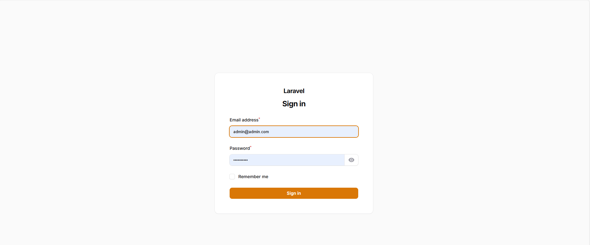
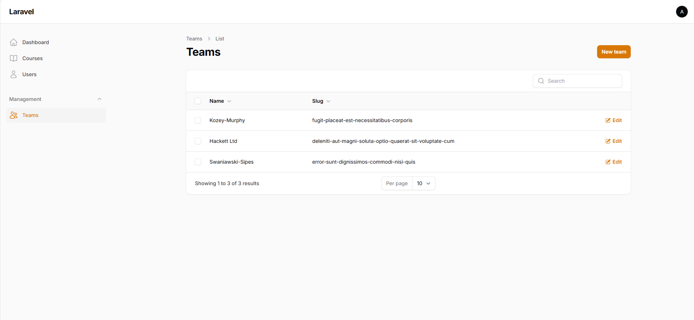
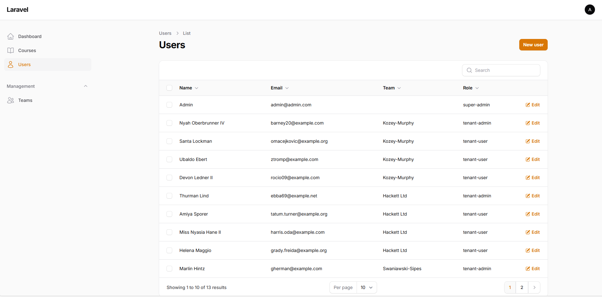
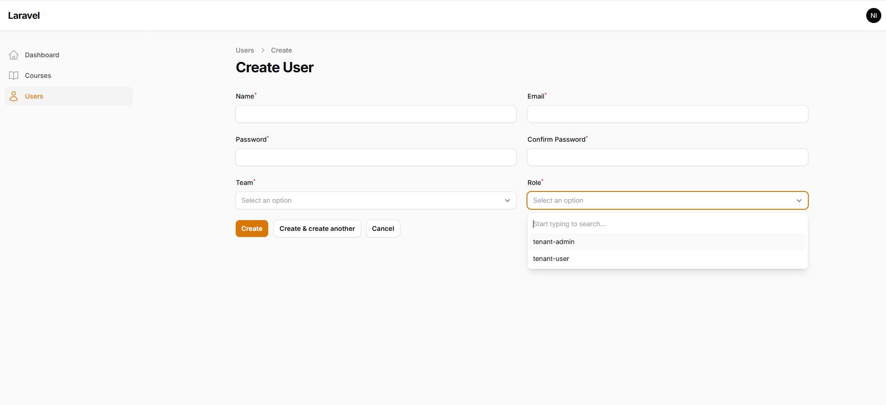
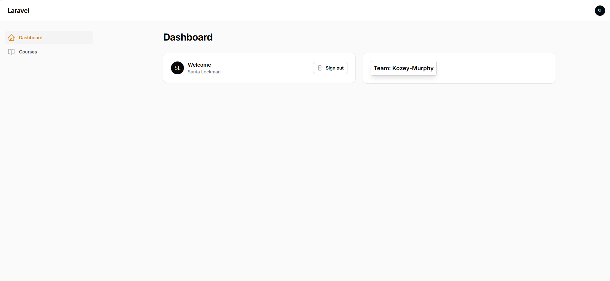
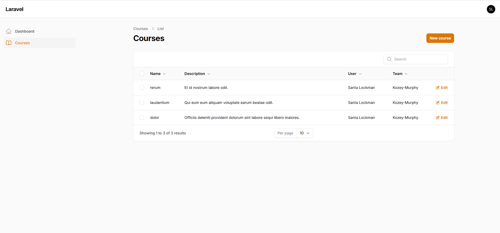

# Multitenancy Courses

This repository demonstrates a Laravel-based multitenancy implementation for managing courses. Below are the setup instructions to get the application running.

## Prerequisites

- PHP 8.1 or higher
- Composer
- Docker and Docker Compose (if running via Docker)
- SQLite (or your preferred database system)

## Setup Instructions

### Common Steps
1. **Create the `.env` file:**
   - Copy the contents of `.env-example` to a new file named `.env`.

2. **Create the SQLite database file:**
   - In the root directory, create a new file named `database.sqlite`. This will be used as the application's database.

3. **Install PHP dependencies using Composer:**   

   ```bash
   composer install
   ```

4. **Run Migrations and seeds:**   

   ```bash
   php artisan migrate

   php artisan db:seed
   ```

### Running the Application with Docker

1. Build and start the Docker containers:

   ```bash
   docker-compose up --build -d
   ```

2. Access the application by navigating to [http://localhost:8000/admin](http://localhost:8000/admin) in your web browser.

### Running the Application Without Docker


1. Start the Laravel development server:

   ```bash
   php artisan serve
   ```

3. Access the application by navigating to [http://localhost:8000/admin](http://localhost:8000/admin) in your web browser.


## Application Previews

Below are some screenshots of the application in action:

-  **admin credentials:**

   user: admin@admin.com
   pass: welcome123

-  **all other user credentials:**

   user: user email
   pass: welcome123


- **Login Page:**

  

- **Super Admin Dashboard:**

  Super Admin can see all teams, users, courses

  

- **Teams Page:**

  Also he can view,create,update,delete any team

  

- **All Users Page:**

  Super Admin have access to all users of the system

  


- **Team Admin Dashboard:**

  This is the team admin dashboard he only can see his team users, courses

  


- **Team Admin Users:**

  This is the team admin users screen where he can manage his team users (CRUD)

  


- **Team Admin User Create:**

  Team admin can create users with roles in his team (team-admin , normale user)

  


- **Team User:**

   Team user can only see his courses

   


- **User Courses:**

   He can have multiple courses as requested , he can (CRUD) only in his courses

     